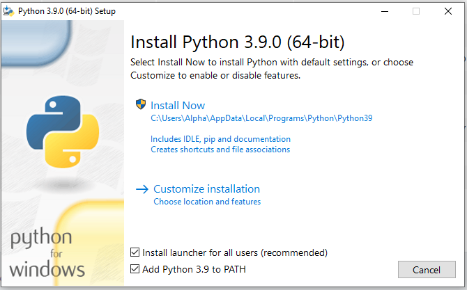

## Instalace nástrojů

Abychom mohli začít programovat, je potřeba na počítač nainstalovat dva programy - samotný jazyk Python a Visual Studio Code. Postup se liší podle toho, jaký máte operační systém. Instrukce pro každý systém zvlášť naleznete níže.

### Windows

Pokud máte počítač s Windows, následujte tyto kroky:

1. Ujistěte se, že máte aktualizovaný systém. To zajistíte nejjednodušeji tak, že svůj počítač restartujete. Pokud jste již dlouho neaktualizovali, při restartu se může spustit aktualizace, která může trvat relativně dlouho, v extrémním případě třeba i hodinu. Nenechte se vyděsit, obrňte se trpělivostí a vyčkejte, dokud Windows opět nenaběhnou.
1. Stáhněte si instalaci jazyka Python z [oficiálních stránek](https://www.python.org/ftp/python/3.9.2/python-3.9.2-amd64.exe). Stažený soubor spusťte. Rozeběhne se průvodce instalací.
1. Na úvodní obrazovce je **velmi důležité** zaškrtnout volbu **Add Python 3.9 to PATH** (viz obrázek)
      
      

        
      

    </li>
    <li>Klikněte na <strong>Install Now</strong>, odsouhlaste případné otázky ohledně změn na vašem počítači a vyčkejte dokončení instalace. Jakmile instalace skončí, zavřete okno tlačítkem <strong>Close</strong>.</li>
    <li>Z <a href="https://aka.ms/win32-x64-user-stable">tohoto odkazu</a> si stáhněte Visual Studio Code.</li>
    <li>Stažený soubor spusťte. Rozeběhne se průvodce instalací, ve kterém stačí klikat na <strong>Next</strong> tak dlouho, dokud se nespustí instalace. Ve druhém kroku je pouze potřeba souhlasit s licencí.</li>
    <li>Jakmile instalace doběhne, zavřete okno tlačítkem <strong>Finish</strong>. Visual Studio Code by se mělo samo spustit ihned po instalaci.</li>
    <li>Pro jistotu restartujte počítač, aby se všechny provedené změny správně usadily.</li>
  </ol>

  <h3>Mac OS</h3>
  
Pokud máte počítač se systémem Mac OS, následujte tyto kroky.

  <ol>
    <li>Stáhněte si instalaci jazyka Python z <a href="https://www.python.org/ftp/python/3.7.1/python-3.7.1-macosx10.9.pkg">tohoto odkazu</a>.</li>
    <li>Stažený soubor spusťte a pokračujte dle pokynů instalace až do jejího konce.</li>
    <li>Z <a href="https://go.microsoft.com/fwlink/?LinkID=620882">tohoto odkazu</a> si stáhněte Visual Studio Code. Spusťte instalaci a opět ji následujte až do zdařilého konce.</li>
  </ol>

  <h3>Linux</h3>
  
Pokud používáte některou z populárních distribucí Linuxu jako Ubuntu, Linux Mint apod., je velká naděje, že už máte Python nainstalovaný. Napište do příkazové řádky příkaz

  <pre>python3</pre>

  
A sledujte, zda se objeví zpráva podobná této:

  <pre>Python 3.6.6 (default, Sep 12 2018, 18:26:19)
[GCC 8.0.1 20180414 (experimental) [trunk revision 259383]] on linux
Type "help", "copyright", "credits" or "license" for more information.</pre>

  
Pokud je verze Pythonu na prvním řádku alespoň 3.5, jste připravení.

