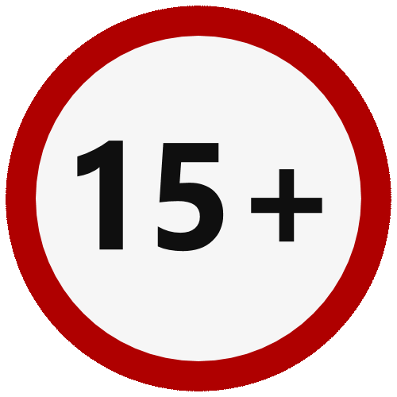

Do této chvíle všechny naše programy vypadaly jako sekvence příkazů vykonávané
jeden za druhým a měly pouze jeden možný průběh. Pro komplikovanější programy
ale budeme potřebovat umožnit, aby se některé části programu vykonaly jen za
určitých *podmínek* , tedy aby se naše programy dokázaly rozhodovat a měnit
svoje chování na základě zadaného vstupu od uživatele.

{.fig .fig-60}

Naše divadlo hraje i divadelní hry, které nejsou vhodné pro děti. Na
takové představení chceme pustit pouze uživatele starší 15ti let. Náš program
tedy musí být schopný se podle zadaného věku rozhodnout, zda uživateli umožní
koupit si lístek nebo nikoliv. Takový program by pak mohl vypadat například
takto:

```python
if vek >= 15:
  print('Vítej na představení')
else:
  print('Dnes to není pro tebe')
```

## Bloky

Všimněte si, že některé řádky v naší podmínce jsou odsazené kousek doprava.
Tímto poprvé narážíme na takzvané bloky kódu. Blok je způsob jak seskupit
několik příkazů do jednoho celku. Takový celek pak může být součástí podmínky
nebo, jak později uvidíme, například cyklu. Blok vždy začíná **dvojtečkou** na
konci předchozího řádku. Tím říkáme k jaké konstrukci (v našem případě `if`)
náš blok příkazů patří.

Odsazování bloků se nejčastěji provádí pomocí několika mezer. Mnoho
programátorů preferuje čtyři mezery, někteří (jako já) preferují dvě mezery.
Jsou i tací, kteří odsazují bloky pomocí jednoho tabulátoru. Podobně jako v
případě jmen proměnných, opět zde přichází do hry různé programovací styly.
Opět je to na jakémsi vašem estetickém cítění. Já budu v tomto kurzu vždy
doporučovat dvě mezery.

Pokud si zvolíte konkrétní styl, je velice důležité jej **dodržovat**. Pokud v
rámci jednoho bloku budete míchat mezery a tabulátory, Python vašemu kódu
nebude rozumět a bude vyhazovat chyby. Pokud budete jeden blok odsazovat
pomocí tabulátorů a jeden pomocí mezer, tak vám to Python odpustí, ale je to
strašlivá prasárna, takže to opravdu nedělejte.

## Podmínky s více větvemi

Podobně jako u filmů tak i u divadelních představení bychom mohli chtít
jemnější rozdělení přístupnosti nějakého představení. Můžeme například mít
představení nevhodné vyloženě pro malé děti, zatímco teenageri jsou v pohodě.
Budeme tady potřebovat podmínku s více větvemi:

```python
if vek < 6:
  print('Předškolák')
elif vek < 15:
  print('Školák')
elif vek < 18:
  print('Mladistvý')
else:
  print('Dospělý')
```

## Porovnávací operátory

V podmínkách jsme zatím používali operátory menší než `<` a větší nebo rovno
`>=`. Zde je přehled všech ostatních porovnávacích operátorů

* rovno: `==`
* nerovno: `!=`
* větší: `>`
* větší nebo rovno: `>=`
* menší: `<`
* menší nebo rovno: `<=`

Všimněte si, že rovnost se testuje pomocí dvou rovná se. Je to proto, že jedno
rovná se už používáme k něčemu jinému - k přiřazení hodnoty do proměnné.

[[[ excs Cvičení
- jednoduche-podminky
- cena-vstupenky
]]]

[[[ excs Bonusy
- registrace
- ruleta
- prestupny-rok
]]]
